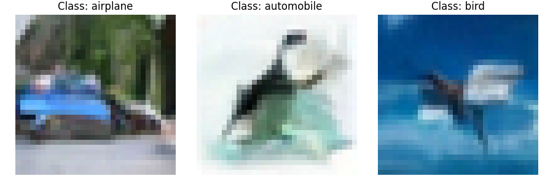

## Generative CIFAR-10

This github is intended to define minimal solution and environment for the generative CIFAR-10 competition.
This competition implement the standard generative CIFAR-10 benchmark.
The competition is hosted on machine learning arena: https://ml-arena.com/viewcompetition/23

The goal of the competition is to achieve the lowest FID. All models are allowed.

## Example outputs

